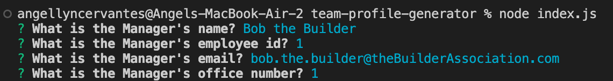
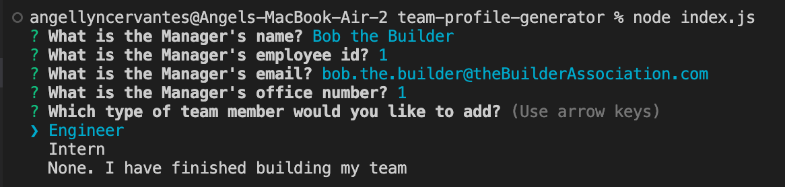
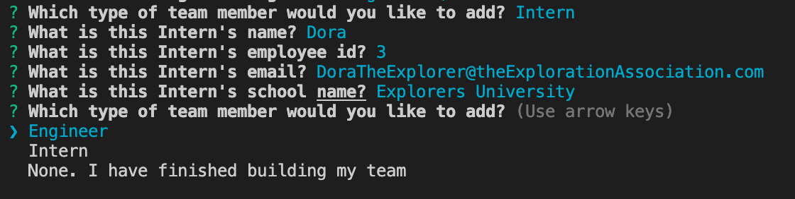
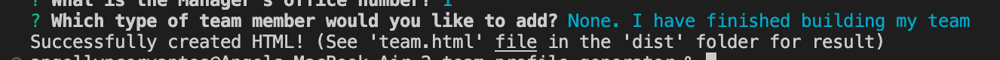

# Team Profile Generator

## Description

When working with a team, it can be good to have a website or place to access information about each team member. To create a team profile, users can run this program. The manager, engineers, and interns' information will be inputed by the user and a website is generated.

While working on this project, I was able to apply what I learned about test creation, classes, and Node.js to a concrete project. I will be sure to use these skills in the future.

## Table of Contents

- [Installation](#installation)
- [Usage](#usage)
- [Tests](#tests)
- [Credits](#credits)
- [License](#license)
- [Badges](#badges)


## Installation

1. Click on green code button and copy the ssh link
2. Open up terminal or git bash, then navigate to where you want the repository to be placed.
3. Type out "git clone (ssh link)"
4. Be sure to install Node.js. Node.js is necessary to run this program. If you need to, download it from [Node.js website](https://nodejs.org/en/download/).
5. Once you have installed Node.js, navigate to inside the 'team-profile-generator' folder
6. Run 'npm install' to install packages within package.json

## Usage

To run the program, navigate to your 'team-profile-generator' folder and type 'node index.js' into the terminal. This will bring up the questions for creating the team 'Manager'



Once the you have answered the manager questions, you can choose to add a new Engineer, add a new Intern, or finish building your team.



If you select 'Engineer', this will bring up the questions for adding an Engineer team member. Once you have answered these questions, the adding a new team membe quesion will be shown again.


If you select 'Intern', this will bring up the questions for adding an Intern team member. Once you have answered these questions, the adding a new team member question will be shown again.



If you select 'None. I have finished building my team', this will generate your resulting team profile website. This website result is the 'team.html' file within the 'dist'.



For a walkthrough video of this program, watch [this video](https://watch.screencastify.com/v/UyegsrcLfSwvEOS5qcHL)

## Tests

A big part of this project was creating tests. To check that the Employee class is intialized correctly, I used the following test:

```
const egName = "Bob";
const egId = 1;
const egEmail = "BobTheBuilder@example.com";

describe("Initialization", () => {
        it("Properties of the employee are set on initialization", () => {
            const obj = new Employee(egName, egId, egEmail);

            expect(obj.name).toEqual(egName);
            expect(obj.id).toEqual(egId);
            expect(obj.email).toEqual(egEmail);
        })
    })
```

This test checks that all properties are set on initialization. There are similar tests for the Manager, Engineer, and Intern classes since they are all subclass of Employee.


## Credits

link email: https://willamette.edu/offices/comm/web/cascadecms/tutorials/links-management/email-link/index.html 

bootstrap for styling: https://getbootstrap.com/docs/5.2/getting-started/introduction/ 

open link in new tab: https://www.freecodecamp.org/news/how-to-use-html-to-open-link-in-new-tab/ 


## License

Please refer to LICENSE in this repository

## Badges


